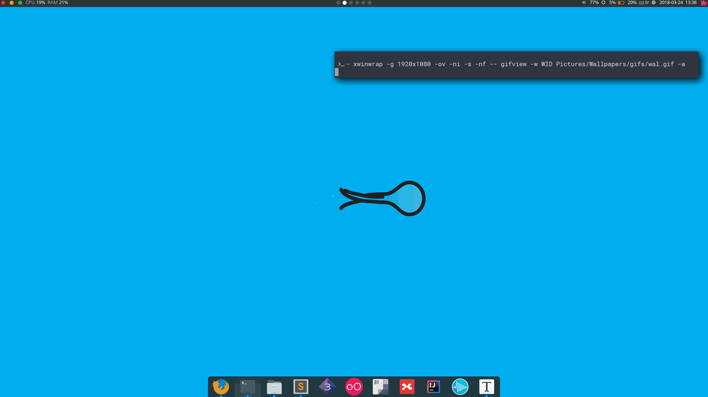

### Use gifs as wallpaper

You can use this command to use gifs as wallpapers

```xwinwrap -g 1920x1080 -ov -ni -s -nf -- gifview -w WID /full/file/path -a```

There are some gifs for use as wallpaper in ./gifs folder

#### Example

