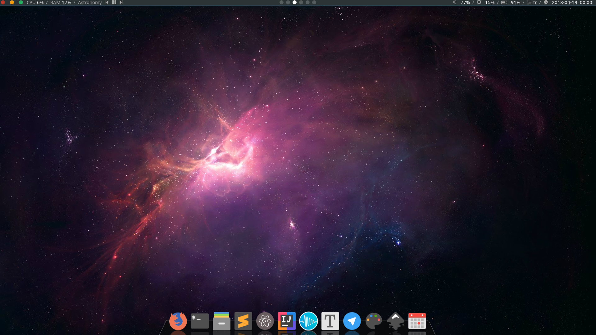
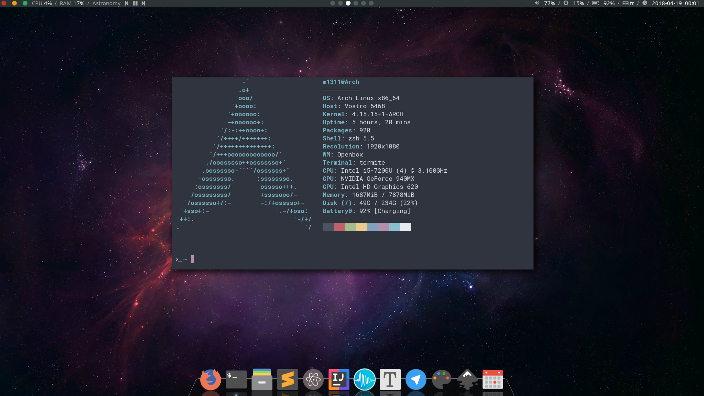
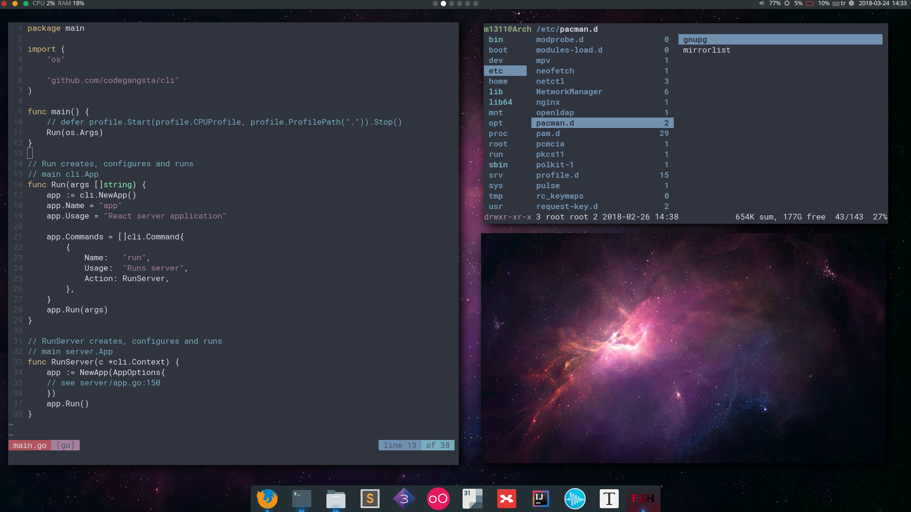

#DOTFILES

## Screenshots

> my theme is vent from [/addy-dclxvi/Openbox-Theme-Collections](https://github.com/addy-dclxvi/Openbox-Theme-Collections)
>
> and icon theme is paper.

## Instalition

Move all the files to the home directory, assuming the root directory of the project is your home directory for installation.(of course, take a backup of your files before change them.)

